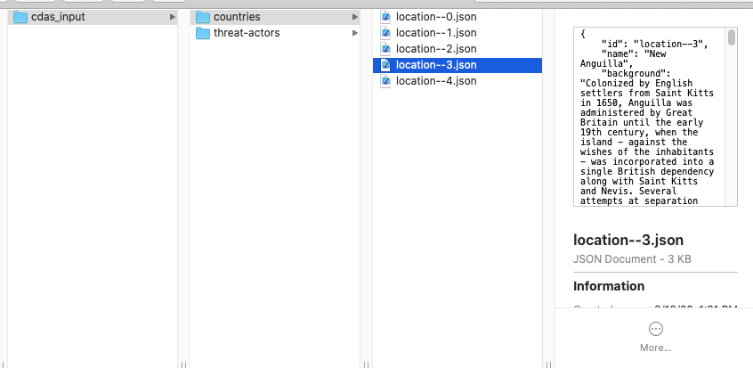

# Cyber Decision Analysis Simulator - CDAS


## Overview

This program generates cyber attack scenarios for use in cyber training exercises, red team planning, blue team planning, automated attack execution, and cybersecurity policy analysis. The current version generates documentation for these scenarios in the form of cyber incident reports and supporting contextual information (information on countries and threat actors). Scenarios can be based on real countries and geopolitical context, or have this context generated psuedo-randomly. Scenarios can use real APTs or have them generated pseudo-randomly to match the geopolitical context. Simulated cyber events are then generated based on APT motivation and organization vulnerability.

Future versions will include fine-grained ability to control detailed aspects of the simulation, improved logic for APT and event generation, and a policy analysis capability allowing decision makers to compare risk reduction or outcome improvements across different policy simulations.

## Features

- [x] Country and geopolitical context generation
- [x] APT generation
- [x] Cyber event generation (incidents, attacks, intelligence)
- [x] Output formats: PDF, JSON, and/or STIX

### ToDo
- [ ] Output formats: HTML, SQL dump
- [ ] Country relationship details
- [ ] Detailed representation of organization networks (asset improvement)
- [ ] Visualization of relationships between data points
- [ ] Improved world map generation
- [ ] "web feeds" of intelligence/events (ex. news reports, dark web posts, etc.)

## Components

- Agents: Threat actors, organizations (companies)
    - Friendly, enemy, and neutral players in the simulation
- Assets: Cyber infrastructure
    - Networks, software, hardware, configurations, and vulnerabilities
- Context: Geopolitical context
    - Countries, country attributes, and relationships with other countries which drive agent decision making
- Simulation
    - Decision parameters, simulation parameters, and output/formatting controls

## Getting Started

These instructions will get you a copy of the project up and running on your local machine.

### Prerequisites

CDAS installs the following packages and their dependencies upon setup:

```
numpy
reportlab
drawSVG
```

You may also want to install ```libcairo2```. Optional, but you will receive errors when running CDAS without it.

### Installing

1. Download CDAS and unzip the download folder
2. From within the top-level cdas folder (where setup.py is located) run

```
$ pip3 install .
```

3. To test that CDAS is installed properly run

```
$ python3 -m cdas -c sample_configs/randomize_all_small_pdf.json
Setting up directories...
Creating fake countries...
Creating fake threat actors...
Running simulation...
        Round 1
        Round 2
        Round 3
        Round 4
        Round 5
Saving output...
        pdf
Done
```

CDAS should finish with no errors (you will get warnings about libcairo2 and CairoSVG if you did not install that) and the results will be in a folder called cdas-output. Results will include
- SVG map of countries
- A "pdf" folder containing
    - 'actors' folder containing PDF files with threat actor descriptions
    - 'countries' folder containing PDF files with country attributes
    - 'reports' folder containing PDF files with event reports
    - 'organizations' folder containing PDF files with organization descriptions

## Configuration

CDAS is configured via a required json file. You will find several sample configuration files in the sample_configs folder. Users can change variables related to geopolitical context generation, asset generation, agent generation, whether to randomize or use real world data, and more. See [Config.md](Config.md) for further instructions.

Additionally, there are three available command line flags: the required config-file, and the optional input and output directories. See the help menu for information on available flags.

```
$ python3 -m cdas -h
usage: __main__.py [-h] -c CONFIG_FILE [-i INPUT_DIRECTORY] [-o OUTPUT_DIRECTORY]

optional arguments:
  -h, --help            show this help message and exit
  -c CONFIG_FILE, --config-file CONFIG_FILE
                        configuration file (json)
  -i INPUT_DIRECTORY, --input-directory INPUT_DIRECTORY
                        directory for specifying custom data
  -o OUTPUT_DIRECTORY, --output-directory OUTPUT_DIRECTORY
                        directory for storing results
```

## Data Customization

The default intrusion set information for CDAS comes from the [Mitre Cyber Threat Intelligence repository](https://github.com/mitre/cti). The default country information comes from the [CIA World Factbook](https://www.cia.gov/library/publications/the-world-factbook/) site. If you prefer to use only a subset of this data, or to use your own custom data, you may do so by providing an input folder at the command line.

```
$ python3 -m cdas -c config.json -i cdas_input/
```

The input folder may have any or all of the following:
* "countries" - folder containing files, each with information on an individual country
    * file name format: "location--XX...XXX.json"
    * required attributes in a location file:
        * id - unique ID, same as file name
        * name
* "defenders" - folder containing files, each with information on an individual defending organization
    * file name format: "defender--XX...XXX.json"
    * required attributes in a defender file:
        * id - unique ID, same as file name
        * name
* "malware" - folder containing files, each with information on an individual malware
    * file name format: "malware--XX...XXX.json"
    * required attributes in a malware file:
        * id - unique ID, same as file name
        * name
    * see the default [malware](cdas/assets/mitre_cti/malware) for examples
* "tools" - folder containing files, each with information on an individual tool
    * file name format: "tool--XX...XXX.json"
    * required attributes in a tool file:
        * id - unique ID, same as file name
        * name
    * see the default [tools](cdas/assets/mitre_cti/tools) for examples
* "threat-actors" - folder containing files, each with information on an individual threat actor
    * file name format: "intrusion-set--XX...XXX.json"
    * required attributes in a intrusion-set file:
        * id - unique ID, same as file name
        * name
    * see the default [threat-actors](cdas/assets/mitre_cti/threat-actors) for examples
* "attack-patterns" - folder containing files, each with information on an individual TTP
    * file name format: "attack-pattern--XX...XXX.json"
    * required attributes in a ttp file:
        * id - unique ID, same as file name
        * name
    * see the default [attack-patterns](cdas/assets/mitre_cti/attack-patterns) for examples
* "relationships.json" - file containing mapping of source and target IDs, along with relationship type. See the [default relationships.json](cdas/assets/mitre_cti/relationships.json) file as an example.

For example:


CDAS will check the input folder first and use the data provided as inputs for those data types (country, threat actor, etc.). For any folders/files not provided in the input folder, CDAS will use either the defaults or create random data (depending on the settings in the configuration file).

Additional customization for CDAS is handled through the configuration file, which allows for changing variables related to geopolitical context generation, agent generation, whether to randomize or use real world data, number of simulation rounds, and more. See [Config.md](Config.md) for further instructions.

To customize the output data beyond the options available in the configuration file, run CDAS with inputs and configuration close to your target, and set the output file type in the configuration file to "json". You can then make changes to the json files provided in the CDAS output. You can even reuse those customized files as input to subsequent iterations of CDAS. 

## License

Copyright 2020 Carnegie Mellon University. See the [LICENSE.md](LICENSE.md) file for details.

## Acknowledgements

* Default country information is pulled from the CIA World Factbook site (https://www.cia.gov/library/publications/the-world-factbook/)
* Default intrusion set information for CDAS comes from the [Mitre Cyber Threat Intelligence repository](https://github.com/mitre/cti).