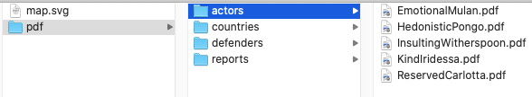
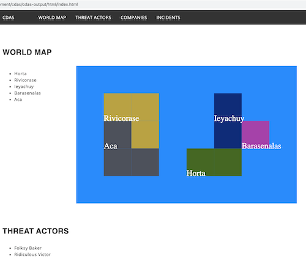
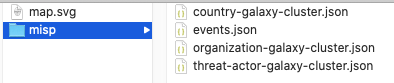
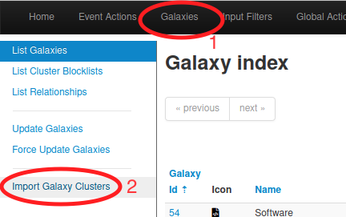
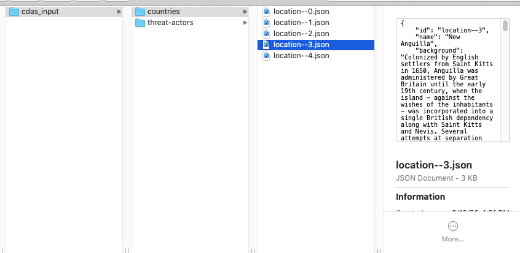

# CDAS User Guide

1. [Installation](#Installing-CDAS)
2. [Running CDAS](#Running-CDAS)
3. [Editing the Configuration File](#Configuration)
    - [Configuring agents](#Agents-Configuration)
    - [Configuring countries](#Country-Configuration)
    - [Configuring defenders](#Defender-Configuration)
    - [Configuring output](#Output-Configuration)
4. [Output](#Output)
    - [PDF](#PDF), [HMTL](#HTML), [JSON](#JSON), [MISP](#MISP)
5. [Customization](#Customization)
    - [Using the Input Folder](#Using-the-Input-Folder)
6. [Use Cases](#Use-Cases)


## Installing CDAS

These instructions will get you a copy of the project up and running on your local machine.

CDAS installs the following packages and their dependencies upon setup:
* numpy
* reportlab
* drawSVG
* cyberdem

1. Download CDAS and unzip the download folder
2. From within the top-level cdas folder (where setup.py is located) run

```
$ pip3 install .
```

3. To test that CDAS is installed properly run

```
$ python3 -m cdas -c sample_configs/randomize_all_small_pdf.json -v
Setting up directories...
Creating fake countries...
Creating fake threat actors...
Running simulation...
        Round 1
        Round 2
        Round 3
        Round 4
        Round 5
Saving output...
        pdf
Done
```

CDAS should finish with no errors and the results will be in a folder called cdas-output. Results will include
- SVG map of countries
- A "pdf" folder containing
    - 'actors' folder containing PDF files with threat actor descriptions
    - 'countries' folder containing PDF files with country attributes
    - 'reports' folder containing PDF files with event reports
    - 'defenders' folder containing PDF files with organization descriptions

[Back to top](#CDAS-User-Guide)
## Running CDAS

CDAS requires Python3 to run, and has been tested with versions 3.7-9. Once installed, it can be run as a python module requiring only a configuration file.

```
$ python3 -m cdas -c sample_configs/randomize_all_small_pdf.json
```
The output will be located in the output folder provided in the config file (default configs use "cdas-output").

More **verbose** output can be generated on the command line by including a ```-v``` or ```-vv```. This is particularly helpful if you are running a large simulation and need to monitor the status.

CDAS also has a help message from the command line:
```
$ python3 -m cdas -h
usage: __main__.py [-h] -c CONFIG_FILE [-i INPUT_DIRECTORY] [-o OUTPUT_DIRECTORY] [--verbose]

optional arguments:
  -h, --help            show this help message and exit
  -c CONFIG_FILE, --config-file CONFIG_FILE
                        configuration file (json)
  -i INPUT_DIRECTORY, --input-directory INPUT_DIRECTORY
                        directory for specifying custom data
  -o OUTPUT_DIRECTORY, --output-directory OUTPUT_DIRECTORY
                        directory for storing results
  --verbose, -v         v for basic status, vv for detailed status
```


[Back to top](#CDAS-User-Guide)
## Configuration

CDAS requires a configuration file at run time, provided by the -c flag on the command line. There are several sample configuration files in the [sample_configs](cdas/sample_configs) folder.

```
$ python -m cdas -c config.json
```

The config file controls whether the data used in the simulator is generated randomly or pulled from default data. It specifies which files to use for data sets and randomization seeding, as well as the settings for the simulation itself. 

The CDAS configuration file has five sections: "agents", "countries", "defenders", "simulation", and "output". 

This section descibes the variables in the configuraiton file.

### Agents Configuration

This section defines the configuration for "agents" or threat actors in the simulation. 

```
    "agents": {
        "randomize_threat_actors": true,
        "random_variables": {
            "actor_name_1": "data/personality_traits.txt",
            "actor_name_2": "data/disney_names.txt",
            "num_agents": 5
        }
    },
```

- randomize_threat_actors
    - True:  generate fake APT profiles
    - False: use APT profiles from the default data set
- random_variables (used if the "randomize_threat_actors" variable is true)
    - actor_name_1 - list of word choices for the first word of the APT actor name
    - actor_name_2 - list of word choices for the second word of the APT actor name
    - num_agents - number of fake APT profiles to generate

### Country Configuration

This section defines the configuration for the geopolitical context component of the simulator.

The coumtries section of the configuration file looks like this:

```
    "countries": {
        "randomize": true,
        "random_vars": {
            "num_countries": 200
        }
    },
```

- randomize
    - True: the simulator generates randomized countries and their associated attributes
    - False: the simulator imports default country data
- random_vars
    - num_countries - the nuber of countries for which the simulator should create fake data; used if the "randomize" variable is true

### Defender Configuration

This section defines the variables for the random creation of defending organizations. There is not a default (non-random) set of defenders available, though users can provide their own set in the input folder to CDAS.

```
"defenders": {
    "number_per_country": 1,
    "org_names": "data/organization_names.txt",
    "sectors": "ANY",
    "countries": "ANY",
    "allow_defense": false
},
```

- number_per_country: number of defending organizations to create per country in the simulation
- org_names: a file containing a list of potential names for defending organizations
- sectors: allows for limiting defenders to certain sectors
    - "ANY" - choose any sector from the default set (provided in [STIX Vocab](cdas/assets/stix_vocab.json))
    - ["sector1", "sector2", "etc"] - a list of sectors (strings)
- countries: allows for limiting defenders to certain countries
    - "ANY" - choose any country from those that have been generated or loaded from the input folder
    - ["country 1", "country 2", "etc"] - a list of country names (strings)
- allow_defense:
    - true: defender makes changes to its network during the simulation
    - false: defender does make changes to its network during the simulation

### Simulation Configuration

This section defines the variables running the simulation and generating events.

```    
"simulation": {
    "number_of_rounds": 5,
    "time_range": [
        "2017-08-01",
        "2020-08-01"
    ]
},
```

- number_of_rounds - Number of times to simulate events. Each threat actor has an opportunity for one action per round. For example, if there are 5 threat actors and 10 rounds, there will be a total of 50 "events" ("sightings" in STIX, and "reports" in PDF).
- time_range - time window over which to space cyber events. Format is is list with start then end date in YYYY-MM-DD format. 

### Output Configuration

This section defines the format, location, and filenames of files generated by CDAS.

```
    "output": {
        "input_directory": "",
        "output_directory": "cdas-output",
        "output_type_opts": ["json", "pdf", "html", "misp"],
        "output_types": ["pdf"],
        "temp_directory": "cdas-temp"
    }
```

- input_directory - Used to provide custom data to CDAS for non-random data. Folders inside input_directory can be 'countries', 'threat-actors', 'malware', 'tools', or 'attack-patterns'. This can also included a "relationships.json" file. If there is no input folder, leave as an empty string (```"input_directory": "",```).
- output_directory - folder to store generated files
- output_type_opts - options available for the "output_types" variable
- output_types - one or more of the available "output_type_opts", separated by commas
    - ex) ```"output_types": ["pdf", "json"],``` would output both PDF and JSON files
- temp_directory - working files directory. Unlikely that this needs to be changed. This folder is deleted after successful completion of the simulation. CDAS will prompt to overwrite an existing folder with this path. 

## Output

CDAS can output results in [PDF](#PDF), [HMTL](#HTML), [JSON](#JSON), or [MISP](#MISP) formats. You can specify one or more types of output for CDAS by changing the "output_types" variable of the configuration file. For instance,

```
"output_types": ["pdf"],
```
will produce PDF output, while 
```
"output_types": ["json", "misp"],
```
will produce both JSON and MISP output (provided in separate folders in the output path).

### PDF

The simplest output that CDAS produces is PDFs, which can be used in various training environments or table-top exercises.  



To produce PDF output, simply change the output_types in the configuration file to "pdf".
```
"output_types": ["pdf"],
```

### HTML

CDAS can produce html files for a website containing the CDAS output. This is probably the cleanest way to include CDAS output in your training environment if you have a webserver available. The webpages do not need any external/third party sources, so they can be dropped into a closed environment.



To produce html output, simply change the output_types in the configuration file to "html".
```
"output_types": ["html"],
```
This will produce files in a folder called html on your output path. To put this on a web server in your training environment simply copy the entire "html" folder from your output path to your hosted web folder.  

### JSON

CDAS holds its temporary working files in json format. Choosing to output CDAS in json format simply dumps these files to the output path once the simulation is complete. This format is useful to for transferring the output to other tools using homemade conversion scripts, or when you need to ingest CDAS output into another CDAS simulation. For example, if you want to reuse countries or threat actors generated by CDAS in a second round of training exercises, you would chose json as one of your output formats in the first simulation. 

To produce json output, simply change the output_types in the configuration file to "json".
```
"output_types": ["json"],
```
This will produce files in a folder called json on your output path.

It is sometimes helpful to output PDFs at the sametime as json output, since the PDFs are more human readable.
```
"output_types": ["json", "pdf"],
```
This provides both json and PDF output in separate folders on your output path.


### MISP

MISP is an open source threat intelligence platform and open standard for threat information sharing. More information can be found on the MISP home page: [https://www.misp-project.org/](https://www.misp-project.org/). Creating MISP output from CDAS is useful if your training or exercise environment includes a MISP server, or if your toolset includes converters for MISP formatted data.

To produce MISP output, simply change the output_types in the configuration file to "misp".
```
"output_types": ["misp"],
```
This will produce four files in a folder called misp on your output path.



Transfer these four files to a location where you can access them from your MISP instance. Log on to your MISP instance and import the galaxy clusters first, starting with the country cluster file. 
1. Click on Galaxies --> List Galaxies from the top nav bar
2. Click on Import Galaxy Clusters from the left nav bar


3. Click on the Browse button and choose the country-galaxy-cluster.json file
4. Click Submit

You should now see the CDAS generated countries in the Galaxy list in the MISP instance. (Name: Country, Namespace: cdas). Load the other two galaxy clusters the same way. 

Once your galaxy clusters are loaded you can load the events. 
1. Click on Event Actions --> List Events from the top nav bar
2. Click "Import from..." on the left nav bar and choose "MISP standard" as your import format
3. Click the Browse button and choose the events.json file
4. Click Upload

You should now see the CDAS generated events in the Events list in the MISP instance.

[Back to top](#CDAS-User-Guide)
## Customization

The default intrusion set information for CDAS comes from the [Mitre Cyber Threat Intelligence repository](https://github.com/mitre/cti) and the default country information comes from the [CIA World Factbook](https://www.cia.gov/library/publications/the-world-factbook/) site. If you prefer to use only a subset of this data, or to use your own custom data, you may do so by providing an input folder at the command line.

Additional customization for CDAS is handled through the configuration file, which allows for changing variables related to geopolitical context generation, agent generation, whether to randomize or use real world data, number of simulation rounds, and more. See [Configuration](#Configuration) section for further instructions.

To customize the output data beyond the options available in the configuration file, run CDAS with inputs and configuration close to your target, and set the output file type in the configuration file to "json". You can then make changes to the json files provided in the CDAS output. You can even reuse those customized files as input to subsequent iterations of CDAS. 

### Using the Input Folder
You can provide customized input files to CDAS by provide an input folder via the command line with the ```-i``` flag. 
```
$ python -m cdas -c config.json -i cdas_input/
```
CDAS will check the input folder first and use the data provided as inputs for those data types (country, threat actor, etc.). For any folders/files not provided in the input folder, CDAS will use either the defaults or create random data (depending on the settings in the configuration file).

The input folder can have any/all of the following folders:

| Folder name     | File name format              | Default references |
| -----------     | ----------------              | ------------------ |
| attack-patterns | attack-pattern--XX...XXX.json | [attack-patterns](cdas/assets/mitre_cti/attack-patterns) |
| countries       | location--XX...XXX.json       | [countries](cdas/data/cia_world_factbook) |
| defenders       | defender--XX...XXX.json       | No default |
| malware         | malware--XX...XXX.json        | [malware](cdas/assets/mitre_cti/malware) |
| networks        | network--XX...XXXX.json       | No default |
| threat-actors   | intrusion-set--XX...XXX.json  | [threat-actors](cdas/assets/mitre_cti/threat-actors) |
| tools           | tool--XX...XXX.json           | [tools](cdas/assets/mitre_cti/tools) |

You can also provide a "relationships.json" file containing mapping of source and target IDs, along with relationship type. See the [default relationships.json](cdas/assets/mitre_cti/relationships.json) file as an example.

For example:


[Back to top](#CDAS-User-Guide)
## Use Cases

### Use case 1: Non-attributed real world countries

*My training exercise requires that I have defending organizations in my own (real-world) country and attackers coming from fake, or at least un-attributed, countries. How do I make that happen?*

There are a couple of approaches depending on your needs. The first approach is to generate as many fake countries as you need, than run the simulation again with those countries, plus your own, as input into CDAS. The other approach is to load a copy of the default set of countries (or some sub-set) as input into CDAS, changing the names of the real-world countries before running the simulation.

**Approach One: Generate fake countries and add yours in**
1. Run CDAS to generate fake countries in json format. Make sure country randomization is set to "true" in your config file, and set the number of fake countries that you need. Also set the output_types to "json".
```
    ...
    "countries": {
        "randomize": true,
        "random_vars": {
            "num_countries": 5
        }
    },
    ...
    "output": {
        ...
        "output_types": ["json"],
    ...
```
2. Copy the country files from your CDAS output folder to a folder for CDAS input (within a folder titled "countries"), then add in a file for your real-world country. You can find the default country files [here](cdas/data/cia_world_factbook).
3. Change the "countries" attribute in the defender section of the config file to the name of your country.
```
    ...
    "defenders": {
        ...
        "countries": ["United States"],
    ...
```
4. Run CDAS, providing the input folder (here, the input folder is called "cdas_input")
```
$ python -m cdas -c config.json -i cdas_input/
```

**Approach Two: Change the names on the real data set**
1. Get a copy of the real-world country json files. You can find them [here](cdas/data/cia_world_factbook).
2. Open the files and change the "name" attribute to whatever you want.
```
"name": Albania,
```
becomes
```
"name": Bramo,
```
You may wish to change other details while you are editing the files.

3. Load those files, in a folder called "countries", into the folder you will use as input to CDAS.
4. Change the "countries" attribute in the defender section of the config file to the name of your country.
```
    ...
    "defenders": {
        ...
        "countries": ["United States"],
    ...
```
5. Run CDAS, providing the input folder (here, the input folder is called "cdas_input")
```
$ python -m cdas -c config.json -i cdas_input/
```

[Back to top](#CDAS-User-Guide)
## License

Copyright 2020 Carnegie Mellon University. See the [LICENSE.md](LICENSE.md) file for details.